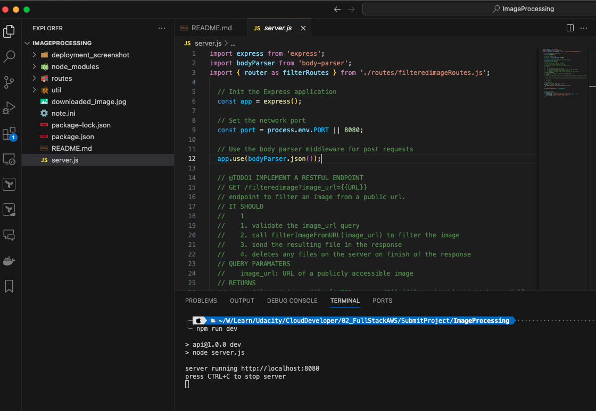
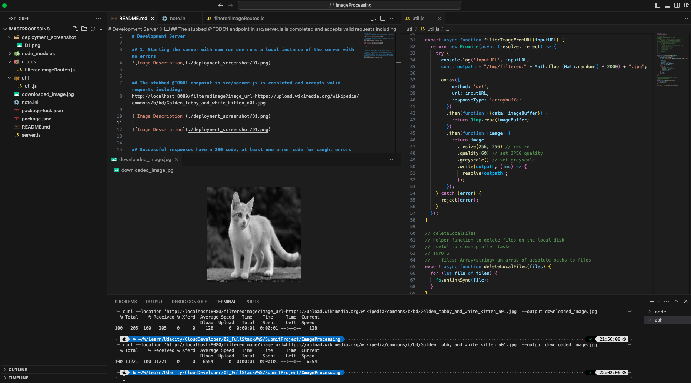
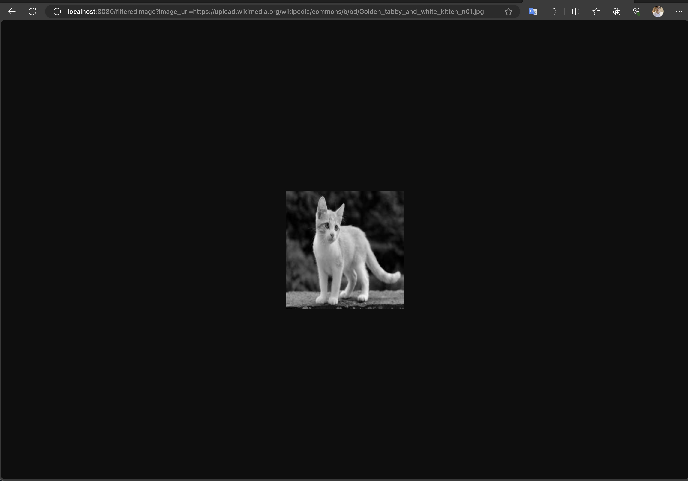
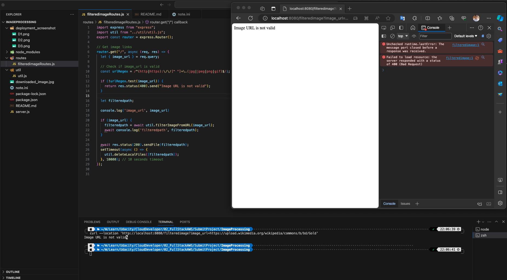
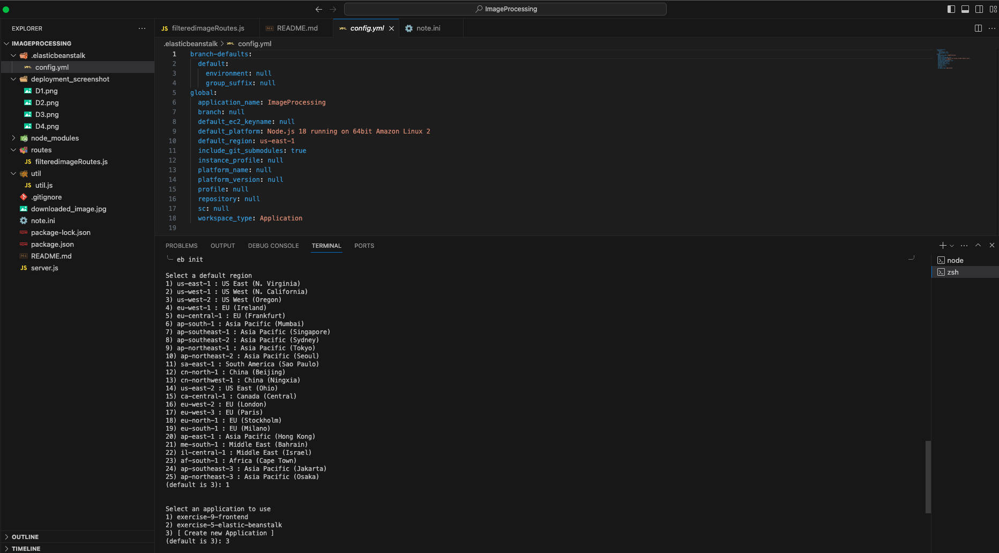
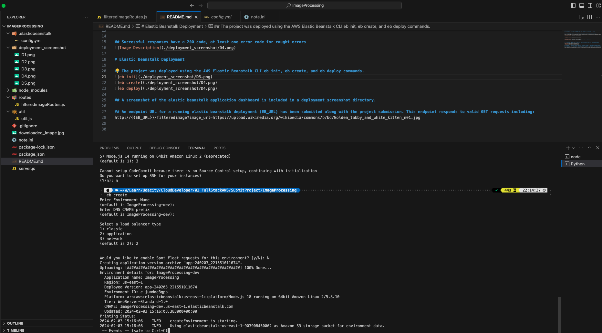
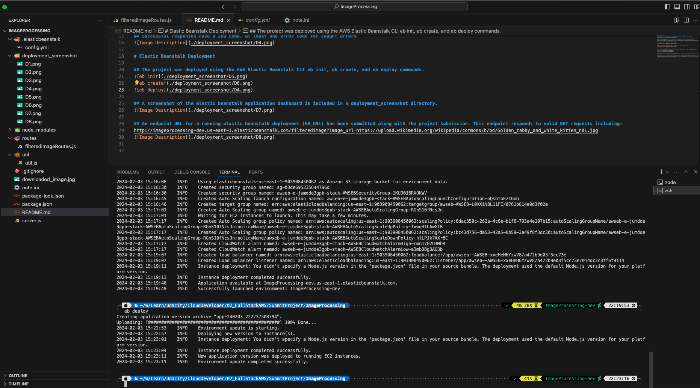
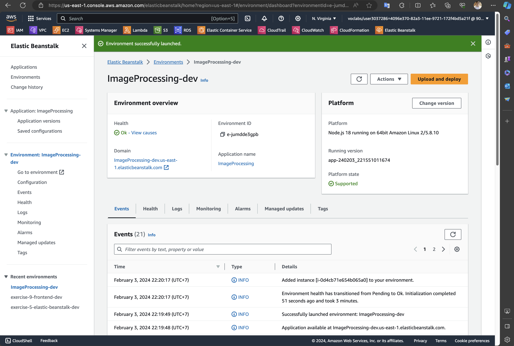
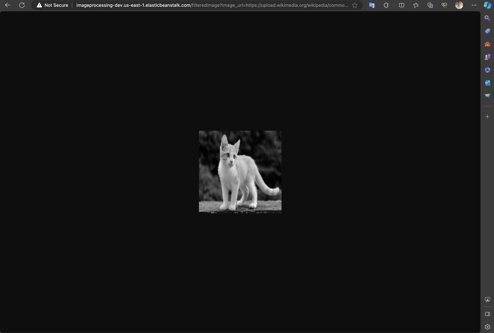

#GET_PASSES_THIS_REPO_UDACITY_PLEASE
# Development Server

## 1. Starting the server with npm run dev runs a local instance of the server with no errors

## The stubbed @TODO1 endpoint in src/server.js is completed and accepts valid requests including:
http://localhost:8080/filteredimage?image_url=https://upload.wikimedia.org/wikipedia/commons/b/bd/Golden_tabby_and_white_kitten_n01.jpg

## Successful responses have a 200 code, at least one error code for caught errors

# Elastic Beanstalk Deployment

## The project was deployed using the AWS Elastic Beanstalk CLI eb init, eb create, and eb deploy commands.
- eb init

- eb create

- eb deploy

## A screenshot of the elastic beanstalk application dashboard is included in a deployment_screenshot directory.

## An endpoint URL for a running elastic beanstalk deployment (EB_URL) has been submitted along with the project submission. This endpoint responds to valid GET requests including:
EB URL: http://imageprocessing-dev.us-east-1.elasticbeanstalk.com

Test URL: http://imageprocessing-dev.us-east-1.elasticbeanstalk.com/filteredimage?image_url=https://upload.wikimedia.org/wikipedia/commons/b/bd/Golden_tabby_and_white_kitten_n01.jpg

